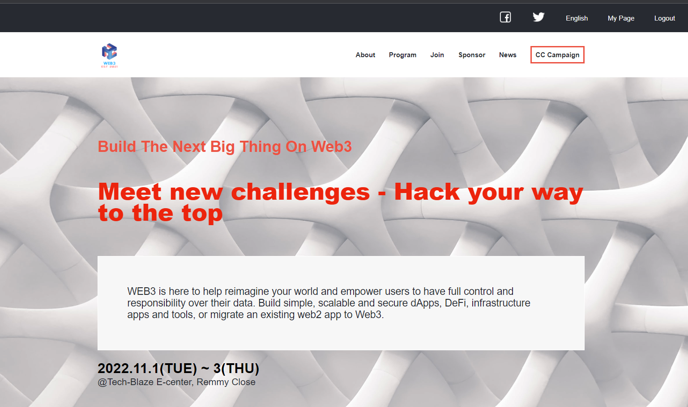

## WEB3 HACKATHON

- This is a website for Web3 Hackathon that entails the program, speakers who will be present and also talks more about the event. It also shows previous events that have happened in different countries. This helped me broaden my understanding in github, githubflows, version control and to demonstrate the ability to submit a project for code review.
## Screenshot of the project



## Link to loom video

- To view a viedo with a decsription of the project you can click on this [link](https://www.loom.com/share/b7948a3e23e64e81a8f0b631c0484b4b).

## Built With

- HTML

- CSS

- Javascript 

- Lighthouse (An open-source, automated tool for improving the quality of web pages. It has audits for performance, accessibility, progressive web apps, SEO and more).

- Webhint (A customizable linting tool that helps you improve your site's accessibility, speed, cross-browser compatibility, and more by checking your code for best     practices and common errors).

- Stylelint (A mighty, modern linter that helps you avoid errors and enforce conventions in your styles).

### Prerequisites

- Have a local version control like Git. Which is a open source distributed version control system designed for source code management
- A text editor (e.g Visual Studio Code, Vim, Atom & Sublime.)
- A web browser (e.g Chrome, Safari, Mozilla Firefox.)
- Live Server which is a web extension that helps you to live reload feature for dynamic content (PHP, Node.js, ASPNET)
- Download waves to check project accessibilty

### Live Demo

- To view a live demo of the project you can click on this [link]( https://v-blaze.github.io/Web3_Hackathon/).

### Getting Started

To get a local copy up and running follow these simple example steps.

- npm
  ```sh
  npm install npm@latest -g
  ```

### Installation

1. Clone the repo by running the command
   ```sh
    git clone https://github.com/V-Blaze/Web3_Hackathon.git
   ```
2. Open the directory of the project
   ```sh
   cd Web3_Hackathon.git
   ```
3. Open the html file
   ```sh
   Click and open the html file

<p align="right">(<a href="#top">back to top</a>)</p>

See the [open issues](#) for a full list of proposed features (and known issues).

## Authors

👤 Grace Muthui

- GitHub: [@V-blaze](https://github.com/V-Blaze)
- Twitter: [@blaze_valentine](https://twitter.com/blaze_valentine)
- LinkedIn: [@valentine-blaze](https://www.linkedin.com/in/valentine-blaze/)

## 🤝 Contributing

- Contributions, issues, and feature requests are welcome!

- Feel free to check the [issues page](https://github.com/Graycemuthui/Conference-Page/issues).

## Show your support

- Give a ⭐️ if you like this project!

## Acknowledgements

- Original design by Cindy Shin in [Behance](https://www.behance.net/gallery/29845175/CC-Global-Summit-2015)

## 📝 License

- This project is [MIT](https://github.com/Graycemuthui/Conference-Page/blob/main/LICENSE.md) licensed.